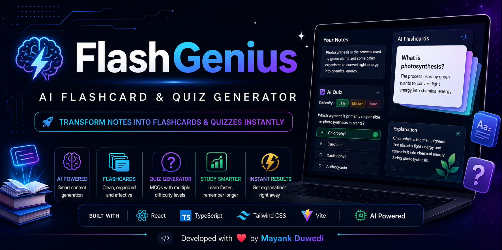
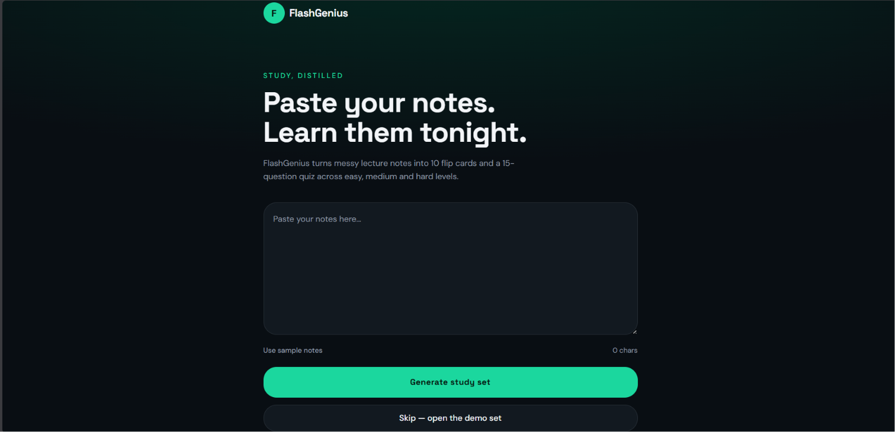
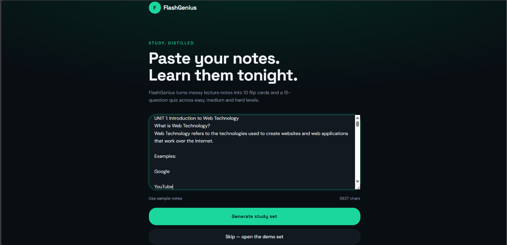
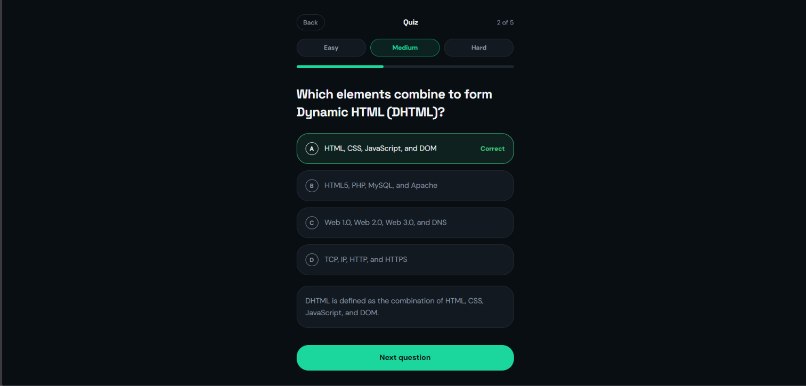
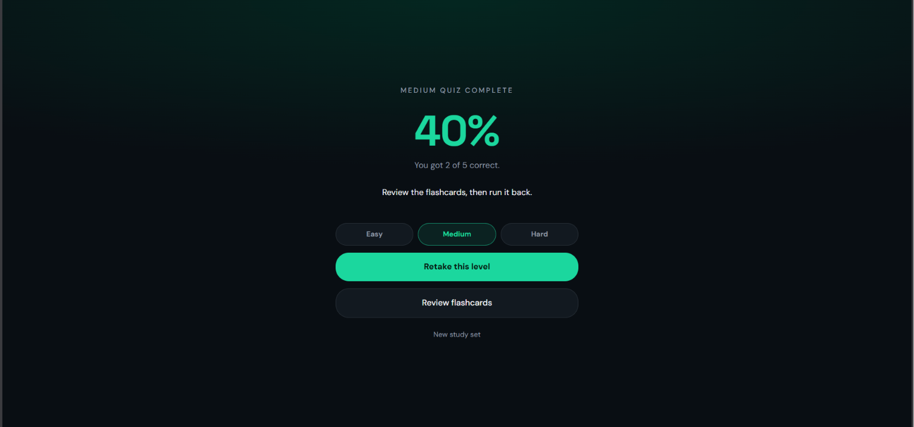

<p align="center">
  
</p>
<p align="center">


<a href="https://genius-study-kit.lovable.app/" target="_blank">

</a>

</p>
# 🚀 FlashGenius — AI Flashcard & Quiz Generator

<p align="center">
  <b>Transform your study notes into AI-powered flashcards and quizzes in seconds.</b>
  <br><br>
  Learn faster • Revise smarter • Study efficiently
</p>

<p align="center">
  
  
  
  
  
  
</p>

---

## 🌐 Live Demo

<p align="center">
<a href="https://genius-study-kit.lovable.app/" target="_blank">

</a>
</p>
---

# 📖 About the Project

**FlashGenius** is an AI-powered study assistant that instantly converts lecture notes into interactive flashcards and multiple-choice quizzes.

Instead of spending hours creating revision material manually, students can simply paste their notes and let AI generate well-structured study content within seconds.

This project was built to make learning faster, easier, and more engaging.

---

# ✨ Features

- 🧠 AI Flashcard Generator
- ❓ AI Quiz Generator
- 🎯 Easy, Medium & Hard Difficulty Levels
- 📚 Instant Note Processing
- 💡 Detailed Answer Explanations
- ⚡ Fast & Responsive Interface
- 🌙 Modern Dark UI
- 📱 Mobile Friendly Design

---

# 🛠️ Tech Stack

| Technology | Usage |
|------------|-------|
| React | Frontend |
| TypeScript | Programming Language |
| Tailwind CSS | Styling |
| Vite | Build Tool |
| Lovable AI | Development Platform |

---

# 📸 Screenshots

## 🏠 Homepage

<p align="center">

</p>

---

## 📝 Notes Input

<p align="center">

</p>

---

## 🃏 AI Questioning

<p align="center">

</p>

---

##  ❤️ AI Answering

<p align="center">


## ❓ AI Quiz

<p align="center">

</p>

---

## 📊 Quiz Results

<p align="center">

</p>
---

# 🚀 Getting Started

Clone the repository

```bash
git clone https://github.com/AIbyMayank/flashgenius-ai.git
```

Go into the project

```bash
cd flashgenius-ai
```

Install dependencies

```bash
npm install
```

Run the development server

```bash
npm run dev
```

---

# 📂 Project Structure

```
src/
components/
pages/
hooks/
public/
```

---

# 🎯 Future Improvements

- 🔐 User Authentication
- 📄 PDF Upload Support
- ☁️ Cloud Storage
- 📊 Progress Dashboard
- 📚 Saved Flashcards
- 🔄 Spaced Repetition
- 📥 Export Flashcards as PDF
- 🎤 Voice Reading
- 📱 Mobile App

---

# 🤝 Contributing

Contributions are always welcome.

If you'd like to improve this project, feel free to fork the repository and submit a pull request.

---

# 👨‍💻 Author

### Mayank Duwedi

**BCA Student | Web Developer | AI Enthusiast**

GitHub:
https://github.com/AIbyMayank

---

# ⭐ Support

If you found this project useful,

⭐ **Please consider giving this repository a Star!**

It really motivates me to build more open-source projects.

---

<p align="center">
Made with ❤️ by Mayank Dwivedi
</p>
